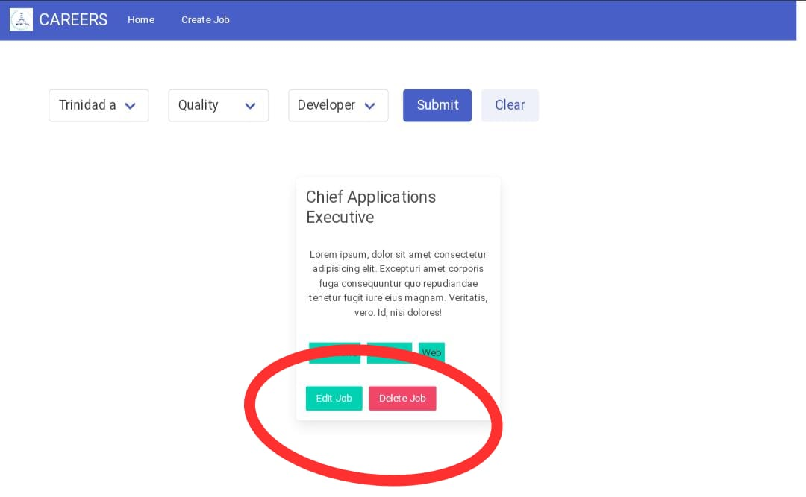

# Buscador de empleos

## Proyecto final Modulo IV ADA ITW
## "Asincronismo"

### Intro
---
- Este `proyecto` fue creado en base al modelo que nos dejó `ADA`, para poner a prueba los `conocimientos adquiridos` hasta este momento.

- Realizado con: 
- `HTML` 
- `Bulma`
- `Javascript`

### Descripción
---
- Es una pagina que te ofrece:
- Generar `nuevas empleos`, donde podrás especificar:
    - `Nombre`
    - `Descripción`
    - `Puesto`
    - `Categoría` 
    - `Zona`
- `Editar` y `Eliminar` los `empleos generados`.
- Cambiar los `filtros` y renderizar una vista de tus empleos segun `categorías`, `zona` o `puesto`.
.
.
.
.

### 💪💪Ahora te invito a ofrecer nuevos puestos de trabajo y encontrar los mejores candidatos!!!! 

### ESPERO QUE SEA ÚTIL PARA EL CRECIMIENTO DE TU EMPRESA!!  

- 👉https://cintyy73.github.io/js-flow/index.html